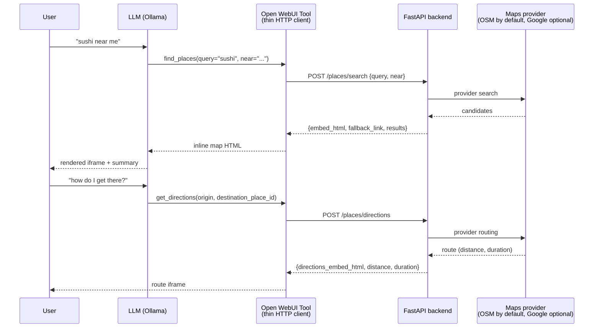

# Design decisions — llm-places-finder

The "why" behind the architecture: the assumptions made, the tradeoffs taken, and what was deliberately left out. The short version is the table; the sections below it give the reasoning.

## TL;DR

| Decision | Choice | Why in one line |
|---|---|---|
| Where maps logic lives | Standalone FastAPI backend, not the Open WebUI Tool | Independently testable; key and quota protection cover all callers |
| Default provider | OpenStreetMap (Nominatim + Overpass + OSRM), no key | Zero cost, zero signup, runs on a clean clone |
| Paid path | Google Maps behind `MAPS_PROVIDER=google` | Drop-in upgrade with no code changes once billing exists |
| Model | `llama3.1:8b` via Ollama (any tool-capable model works) | Local, function-calling-capable, backend contract is model-agnostic |
| Search + directions | Two separate endpoints | One billable call per need; no paying for routes nobody asked for |
| Quota protection | 5-min TTL cache + per-IP rate limiter, backend-side | Kills repeat-query waste where bypass isn't possible |
| Key handling | Env-only, keyless embed iframes | Secret never reaches Tool, browser, logs, or git |
| Embed style | Keyless `output=embed` iframes, not Embed API `embed/v1` | Same pin/route view without shipping a credential to the browser |

## Architecture overview

One rule governs the whole design: **the LLM never touches a maps API**. It only decides *when* a place search is needed and *what arguments* to pass. Everything else is plain HTTP between three processes:

The API key, caching, and rate limiting all live in the FastAPI backend. The Tool is a passthrough: `httpx.post(...)` → return HTML. The browser never sees the key.

## Key decisions

### Standalone FastAPI service instead of logic in the Open WebUI Tool
**Rationale:** the Tool runs inside Open WebUI's plugin sandbox and can't be tested standalone; a separate `uvicorn` service is independently testable with `curl`/Postman, keeps the key in one server-side place (`api/config.py`), and lets caching/rate limiting protect the provider quota for *all* callers, not just one chat UI.

### Model: llama3.1:8b via Ollama
**Rationale:** function-calling-capable, runs locally on modest hardware, and pairs with Open WebUI's Tool system out of the box. Assumption: any Ollama model with tool support (mistral, qwen2.5, …) works the same way — model choice doesn't change the backend contract, since the Tool schema is just `(query, near)`.

### Places search plus a separate Directions call
**Rationale:** no single provider endpoint returns both "best matching places" and "route from origin" in one billable call. Search answers "what/where"; directions answers "how to get there" (the brief's "view the location direction" line). Splitting them also keeps billing legible: one search charge, plus a routing charge only on follow-up.

### In-memory TTL cache (5 min) + per-IP sliding-window rate limiter
**Rationale:** scoped for a single-instance service. The cache keys on the normalized `query||bias` string and kills the most common waste (re-asking the same thing); the limiter sits on the upstream-calling endpoints (`/places/search`, `/places/nearby`, `/places/directions`) at the backend layer, because Tool-side limits are bypassable. Assumption: one process, trusted localhost callers — enough for this exercise; Redis is the documented next step for multi-instance use.

### API key isolated in backend env, never in output HTML
**Rationale:** the key is the billing identity. It is read only in `api/config.py` (required only in Google mode — OSM mode never touches it), never logged, and never embedded in output: the keyless universal-embed iframes (`maps.google.com/maps?...&output=embed`) render the same pin/route view without leaking the credential to the Tool, the browser, logs, or git (`.env` is gitignored). The boundary matters because a leaked key = someone else's spend on your quota. Selecting `MAPS_PROVIDER=google` without a key fails fast with a clear error instead of silently falling back and hiding the misconfiguration.

### Provider abstraction: OSM by default, Google behind an env var
**Rationale:** Google Cloud billing verification requires card funds not available at development time, so the backend needed to run without Google at all — and stay usable immediately for review either way. `api/providers/base.py` defines a `PlacesProvider` interface (`find_places` / `find_nearby` / `get_directions` with identical normalized shapes); the Google logic lives in `GoogleMapsProvider`, and a free `OsmProvider` (Nominatim search + Overpass category search + OSRM routing, no key, no billing) is the default via `MAPS_PROVIDER=osm`. The endpoints resolve the provider per request through `config.get_places_provider()` and never branch on which one is active.

What the free provider gains versus Google: zero cost, zero signup, works immediately. What it loses: no ratings/reviews, weaker fuzzy search ("sushi near me" style queries resolve less gracefully than Google's Text Search), category search depends on correctly mapping natural-language categories to OSM tags (a small, extendable dict in `osm_provider.py` — unmapped categories fall back to a best-guess `amenity=` tag), and the public Nominatim/Overpass/OSRM servers are rate-limited community infrastructure not meant for production load (the provider self-throttles at ~1 req/s and caches; production would need self-hosting or a paid geocoder). What stays identical: endpoint contracts, response models, rate limiting, and the shared exception set.

`MAPS_PROVIDER=google` is a drop-in production path with no code changes, once billing is available.

### Zero-config run: `.env` optional, sane defaults everywhere
**Rationale:** a reviewer (or recruiter) should be able to `git clone` and `docker compose up --build` with no setup. Every setting has a working default, so `docker-compose.yml` treats `.env` as optional (`required: false`) and the container starts on OSM out of the box. `.env` exists only to *override* — Google mode, tighter limits, different origins. Assumption: localhost development; production would inject real secrets via its own env management, never a committed file.

### Tool shows raw `place_id`s; provider tolerates URL-encoded ids
**Rationale:** the model must copy the destination id *literally* into `get_directions`, but the only other place the id appears — URL-encoded inside the iframe `src` — is not safe to copy (a real failure seen in testing: `node%2F12345` instead of `node/12345`). So the Tool lists each result with its raw id in plain text, the Tool docstring tells the model to copy it exactly, and the OSM provider defensively unquotes the id before lookup. Belt and suspenders across the exact boundary where the failure occurred.

## What was explicitly out of scope

Deliberate boundaries for this exercise — mirrored in the README's "Scope and next steps" note:

- Auth for multi-user access (backend API-key header / OAuth) — localhost-only by design.
- Database-backed cache (Redis/persistent) shared across instances.
- Automated quota monitoring / key rotation / budget-alert wiring.
- Multi-turn location context ("near me" resolution, remembering the last city).
- i18n, accessibility hardening of embeds, mobile layout tuning.
- Single-language responses (whatever the provider returns; no translation layer).

With more time, in order: (1) backend auth header + per-key quotas, (2) Redis cache shared across replicas, (3) Cloud budget-alert wiring/runbook + key rotation, (4) conversation-state location memory.

## Tradeoffs considered and rejected

- **Letting the Open WebUI Tool call the maps API directly — rejected** because it would put the API key outside a testable, independently runnable service, force every Open WebUI install to hold a secret, and leave quota protection to client-side code that any caller could bypass.
- **Official Embed API `embed/v1/place?key=...` iframes — rejected** because that pattern requires shipping a (referrer-restricted) key to the browser; the keyless `output=embed` iframe renders the same pin/route view without leaking the billing credential, at the cost of fewer styling options.
- **One combined "search + directions" endpoint — rejected** because it would bill a routing call on every search even when the user only wants a pin, and couples two failure modes (no places vs. no route) into one response.
