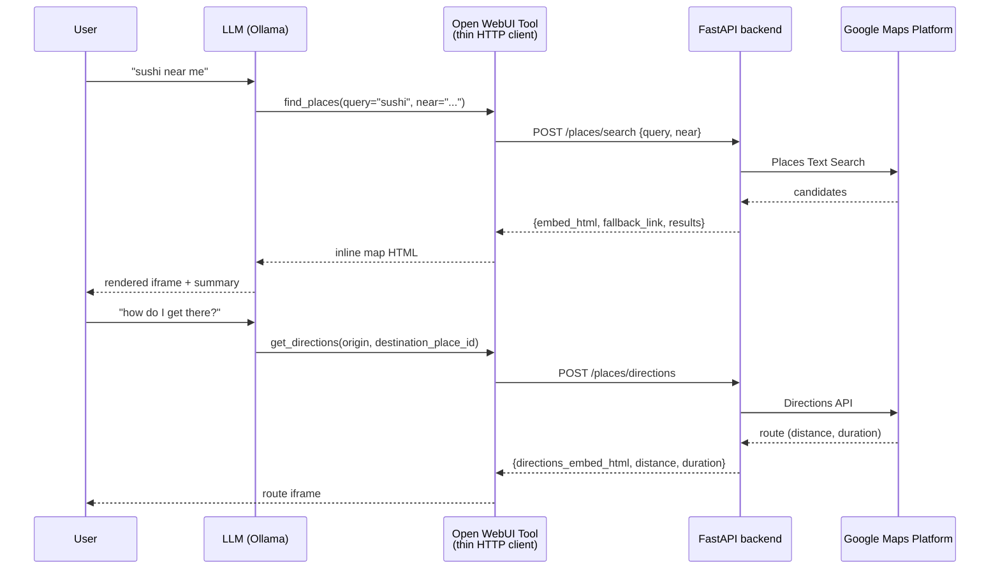

# Design decisions — llm-places-finder

Written for a reviewer: the "why" behind the architecture, the assumptions made, and what was left out.

## Architecture overview

The LLM never touches Google Maps. It only decides *when* a place search is needed and *what arguments* to pass. Everything else is plain HTTP between three processes:

The API key, caching, and rate limiting all live in the FastAPI backend. The Tool is a passthrough: `httpx.post(...)` → return HTML. The browser never sees the key.

## Key decisions

### Standalone FastAPI service instead of logic in the Open WebUI Tool
**Rationale:** the Tool runs inside Open WebUI's plugin sandbox and can't be tested standalone; a separate `uvicorn` service is independently testable with `curl`/Postman, keeps the key in one server-side place (`api/config.py`), and lets caching/rate limiting protect the Google quota for *all* callers, not just one chat UI.

### Model: llama3.1:8b via Ollama
**Rationale:** function-calling-capable, runs locally on modest hardware, and pairs with Open WebUI's Tool system out of the box. Assumption: any Ollama model with tool support (mistral, qwen2.5, …) works the same way — model choice doesn't change the backend contract, since the Tool schema is just `(query, near)`.

### Places Text Search plus a separate Directions call
**Rationale:** no single Google endpoint returns both "best matching places" and "route from origin" in one billable call. Text Search answers "what/where"; Directions answers "how to get there" (the spec's "view the location direction" line). Splitting them also keeps billing legible: one search charge, plus a directions charge only on follow-up.

### In-memory TTL cache (5 min) + per-IP sliding-window rate limiter
**Rationale:** scoped for a single-instance test service. The cache keys on the normalized `query||bias` string and kills the most common waste (re-asking the same thing); the limiter sits on the upstream-calling endpoints (`/places/search`, `/places/nearby`, `/places/directions`) at the backend layer, because Tool-side limits are bypassable. Assumption: one process, trusted localhost callers — enough for this exercise.

### API key isolated in backend env, never in output HTML
**Rationale:** the key is the billing identity. Reading it only in `api/config.py`, refusing to start without it, never logging it, and using keyless universal-embed iframes (`maps.google.com/maps?...&output=embed`) means the secret never reaches the Tool, the browser, logs, or git (`.env` is gitignored). The boundary matters because a leaked key = someone else's spend on your quota.

### Provider abstraction: OSM by default, Google behind an env var
**Rationale:** Google Cloud billing verification requires card funds not available at development time, so the backend needed to run without Google at all — and stay usable immediately for review either way. `api/providers/base.py` defines a `PlacesProvider` interface (`find_places` / `find_nearby` / `get_directions` with the same normalized shapes as before); the unchanged Google logic moved to `GoogleMapsProvider`, and a free `OsmProvider` (Nominatim search + Overpass category search + OSRM routing, no key, no billing) became the default via `MAPS_PROVIDER=osm`. The endpoints resolve the provider per request through `config.get_places_provider()` and never branch on which one is active. Selecting `MAPS_PROVIDER=google` validates the key eagerly so a missing key fails fast instead of silently falling back and hiding the misconfiguration.

What the free provider gains versus Google: zero cost, zero signup, works immediately. What it loses: no ratings/reviews, weaker fuzzy search ("sushi near me" style queries resolve less gracefully than Google's Text Search), category search depends on correctly mapping natural-language categories to OSM tags (a small, extendable dict in `osm_provider.py` — unmapped categories fall back to a best-guess `amenity=` tag), and the public Nominatim/Overpass/OSRM servers are rate-limited community infrastructure not meant for production load (the provider self-throttles at ~1 req/s and caches; production would need self-hosting or a paid geocoder). What stays identical: endpoint contracts, response models, rate limiting, and the shared exception set.

`MAPS_PROVIDER=google` is a drop-in production path with no code changes, once billing is available — the Google implementation (Text Search, Nearby Search, Directions) works unchanged.

## What was explicitly out of scope

- Multi-turn location context ("near me" resolution, remembering the last city).
- Database-backed cache (Redis/persistent) shared across instances.
- Auth for multi-user access (backend API-key header / OAuth).
- Automated Google Cloud quota monitoring / key rotation.
- i18n, accessibility hardening of embeds, mobile layout tuning.

With more time, in order: (1) backend auth header + per-key quotas, (2) Redis cache shared across replicas, (3) Cloud budget-alert wiring/runbook, (4) conversation-state location memory.

## Tradeoffs considered and rejected

- **Letting the Open WebUI Tool call Google Maps directly — rejected** because it would put the API key outside a testable, independently runnable service, force every Open WebUI install to hold a secret, and leave quota protection to client-side code that any caller could bypass.
- **Official Embed API `embed/v1/place?key=...` iframes — rejected** because that pattern requires shipping a (referrer-restricted) key to the browser; the keyless `output=embed` iframe renders the same pin/route view without leaking the billing credential, at the cost of fewer styling options.
- **One combined "search + directions" endpoint — rejected** because it would bill a Directions call on every search even when the user only wants a pin, and couples two failure modes (no places vs. no route) into one response.
